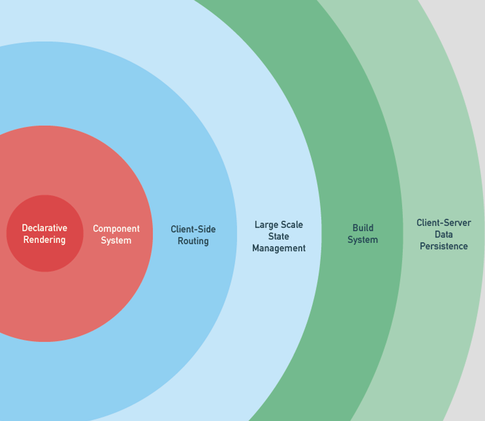

# Single Page Applications con Vue

<div class="u-textCenter">
  `new Vue({
    el: '#app',
    data: {
      message: 'Hello Vue!'
    }
  })`
</div>

--

# ¿Quién soy? 👨🏻‍🔧
`<raul/>`

> Me apasiona aprender, la web y el desarrollo.

--

# ¿Por qué Vue?

## Porque es
`Vue-nísimo`

# 😆

--

# Complejidades 😮

--

# Inherente vs Instrumental 🛠

--

# ¿Qué es Vue?

`(pronounced /vjuː/, like view)`

### Progressive framework for building user interfaces.

--

# Conceptos de Vue 🎯

* Un _core_
* Basado en _MV_
* Reactividad _Virtual DOM_
* Orientado a componentes
* Open Source y creciente ecosistema

--



--

# ¿Porque elegir Vue? 🤔


--


--

# SPA

--

# Conceptos sobre SPA
> Todo funciona en un sola página.

* Todo se carga una sola vez (HTML/CSS/JS)
* La experiencia de usuario es más fluida (no refresh)
* Se optimizan los recursos entregados
* En el concepto nos permite separar recursos cliente/servidor

--

# Hello World

html
```html
<script src="https://unpkg.com/vue"></script>

<div id="app">
  {{ message }}
</div>
```
javascript
```javascript
new Vue({
  el: '#app',

  data: {
    message: '',
  },
})
```

--

# ¿Que necesitamos para seguir? ✨

* Conocimientos de Javascript
* Algo de ES6
* Terminal
* Node + Npm
* 💪 Ganas

--

# Instalación y primeros pasos 🏁

```
$ npm install -g vue-cli
$ vue init webpack my-project
$ cd my-project
$ npm install
$ npm run dev // npm run build
```

↪️ https://github.com/vuejs-templates

--

# Estructura
```.
├── build/                      # webpack config files
│   └── ...
├── config/
│   ├── index.js                # main project config
│   └── ...
├── src/
│   ├── main.js                 # app entry file
│   ├── App.vue                 # main app component
│   ├── components/             # ui components
│   │   └── ...
│   └── assets/                 # module assets (processed by webpack)
│       └── ...
├── static/                     # pure static assets (directly copied)
├── test/                       # unit tests
├── .babelrc                    # babel config
├── .editorconfig               # indentation, spaces/tabs and similar settings for your editor
├── .eslintrc.js                # eslint config
├── .eslintignore               # eslint ignore rules
├── .gitignore                  # sensible defaults for gitignore
├── .postcssrc.js               # postcss config
├── index.html                  # index.html template
├── package.json                # build scripts and dependencies
└── README.md                   # Default README file
```

--

# Componente


💡 Lifecycle https://vuejs.org/v2/guide/instance.html#Lifecycle-Diagram

--

## Demo
# Vuedium ✨

--

# Vuedium v0.1

* API + CRUD
* Components _para diferentes acciones_
* Mostrar historias recientes
* Crear historia
* Editar historia

--

# Deploy + Netlify

* Netlify CDN
* One-Click SSL
* Continuous Deployment
* Gradual Migration
* Infinite Scale
* Prerendering
* Atomic Deploys
* Instant Cache Invalidation
* Instant Rollbacks
* CLI
* ...

```
$ npm run build
```
--

# Demo deployment

--

# Algunos tips

* Cada componente debe resolver una sola cosa (y lo debe hacer bien)
* Separar bien las responsabilidades (dependencias, librerias)
* Optimiza los recursos (gzip, minify, cdn, cache, concatenation, images)
* Usar prerendering o ssr donde puedas
* Indica siempre al usuario los estados y que esta pasando (incluso en segundo plano)
* Si te interesa el SEO quizas tu enfoque es SSR

> Si quieres ir mas allá, aprende sobre PWA... ✨

--

# Recursos útiles

* https://vuejs.org
* https://github.com/vuejs/awesome-vue

--

# Gracias, ¿preguntas?
